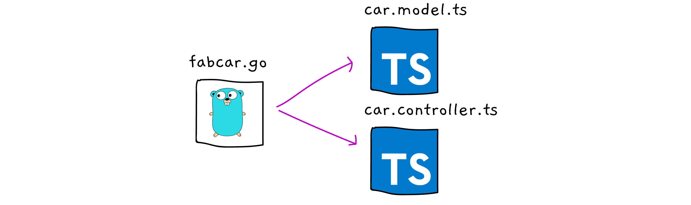

# Fabcar example in Convector code

This is a <a href="https://github.com/worldsibu/convector-cli" target="_blank">Convector-CLI</a> generated project for Hyperledger Fabric.

It is based on the <a href="https://github.com/hyperledger/fabric-samples" target="_blank">Fabcar chaincode created in Fabric-samples</a>.

The idea is to showcase how to migrate your mental concepts from Go development to TypeScript based Convector smart contracts.



## Prerequisites

- <a href="https://medium.com/r/?url=https%3A%2F%2Fwww.docker.com%2Fcommunity-edition" target="_blank">Docker</a>
- <a href="https://medium.com/r/?url=https%3A%2F%2Fnodejs.org%2Fen%2Fdownload%2F" target="_blank">NodeJS 8.11.0</a>

## Run this project

```bash
# Compile everything
npx lerna bootstrap
# Wake yourself up a dev blockchain
npm run env:restart
# Now install the chaincode!
npm run cc:start -- car 1
```

There is also included a NodeJS backend to make a few REST endpoints available.

```bash
# Start the backend
npx lerna run dev:debug --scope myapp --stream
```

A few API endpoints will be available at http://localhost:300. You can test them out with Postman.

```
GET localhost:3000/api/v1/examples
GET localhost:3000/api/v1/examples/1
POST localhost:3000/api/v1/examples/
Body
{
 "make":"Volkswagen",
 "model":"Jetta",
 "colour":"gray",
 "owner":"Walter Montes",
 "id":"1"
}
```

## How it was done - Smart Contract

As simple as the example looks like, getting around all the Go code may be confusing, so we made it even easier with the framework's CLI. 

```bash
# In case you don't have Convector-CLI installed already
npm i -g @worldsibu/convector-cli
conv new fabcar -c car
cd fabcar
npm i
```

Modify the default `./packages/car-cc/src/car.model.ts.` and `./packages/car-cc/src/car.controller.ts.`, refer to **Run this project** section.

### Learn how to make the smart contract from scratch

<a href="https://hackernoon.com/hyperledger-fabric-convector-convector-cli-javascript-only-f4a0919b11c1" target="_blank">A tutorial in Hacker Noon here.</a>

## Original smart contract code

You can find the original <a href="https://github.com/hyperledger/fabric-samples/blob/release-1.3/chaincode/fabcar/go/fabcar.go" target="_blank">Go Fabcar example here</a> as well the original <a href="https://github.com/hyperledger/fabric-samples/blob/release-1.3/chaincode/fabcar/node/fabcar.js" target="_blank">NodeJS non-Convector file</a>. That way you can compare how a Convector file helps you build better code.

This examples is provided under an Apache 2.0 license.
